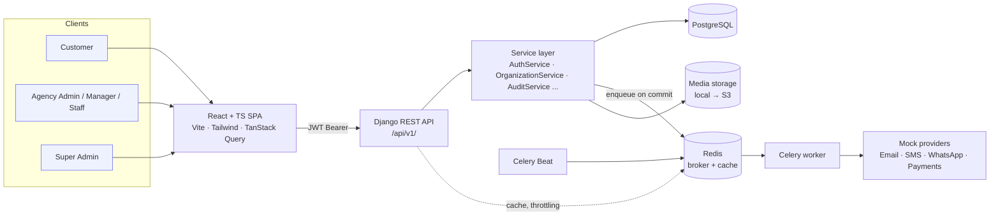
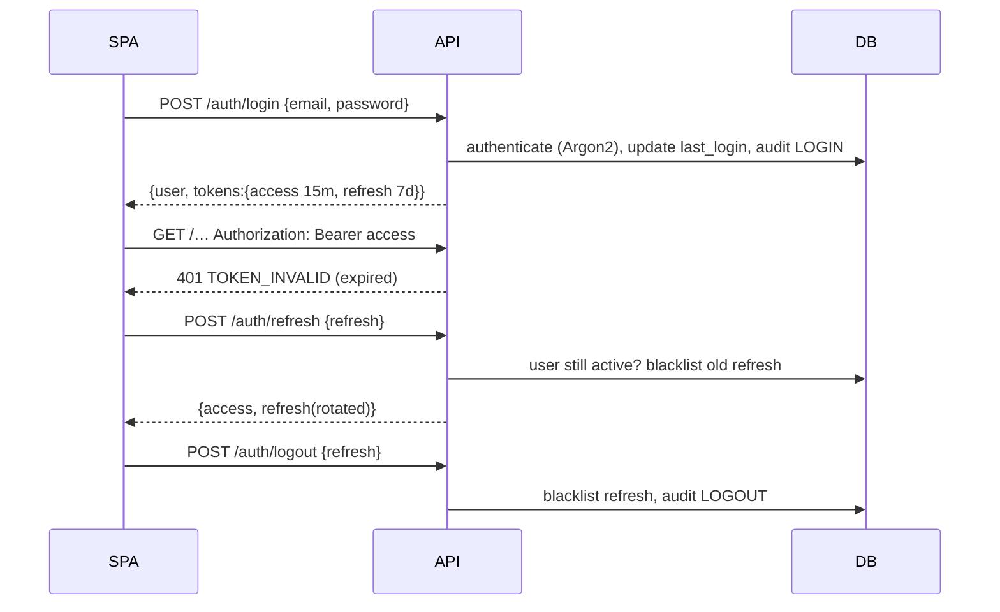
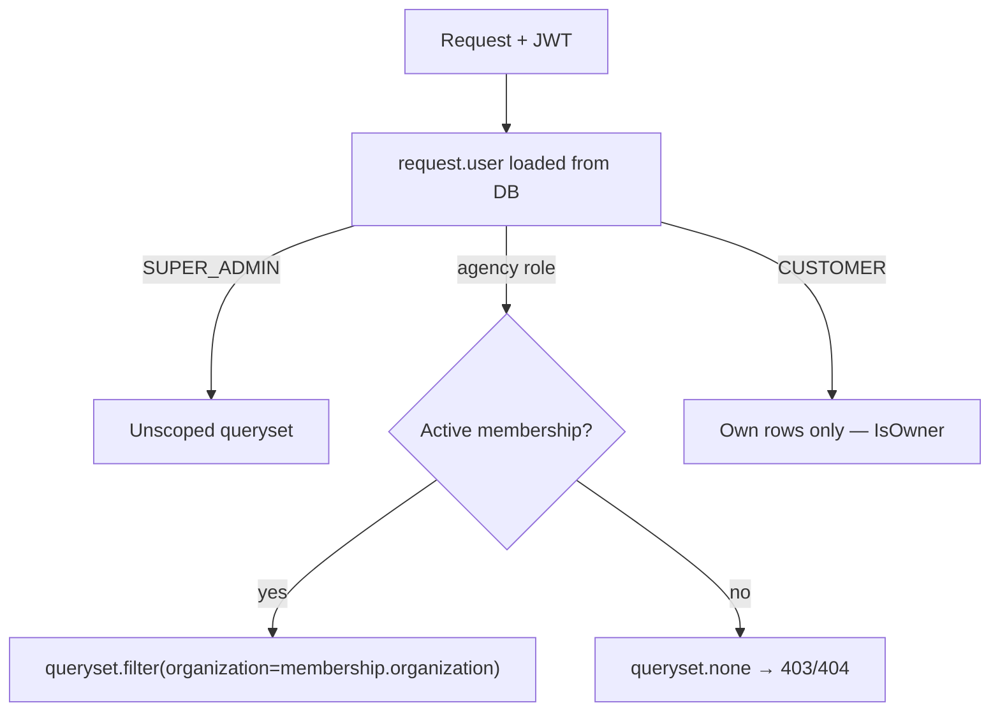
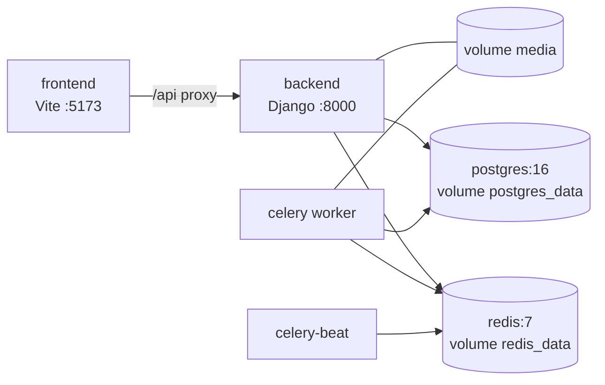

# Architecture

> Multi-Vendor Vehicle Service CRM — **built by Sahil Thakur**

## 1. System overview



* The SPA never computes business truth (availability, prices, permissions). It renders what the API returns.
* Views are thin: validate input with a serializer, call a service, serialize the result.
* Slow or external work (e-mail, later SMS/WhatsApp, reminders, PDFs) is queued with
  `transaction.on_commit(...)` so a task never runs for a rolled-back transaction.

## 2. Django apps

| App | Status | Responsibility |
|---|---|---|
| `core` | **Phase 1** | `BaseModel` (UUID + timestamps), `TenantModel`, tenant-aware querysets, permission classes, response envelope, exception handler, pagination, storage abstraction, upload validators, health check, `seed_demo_data` |
| `accounts` | **Phase 1** | Custom `User` (e-mail login, role), JWT auth, password reset, e-mail verification, user activation |
| `organizations` | **Phase 1** | Agencies (tenants), status/verification workflow, memberships |
| `audit_logs` | **Phase 1** | Immutable audit trail (ORM guards + PostgreSQL trigger) |
| `vendors` | ✅ Phase 2 | Staff management, permissions editing, working hours, holidays, resources |
| `customers`, `vehicles` | ✅ Phase 3 | Customer profiles, agency links, tenant-private notes, vehicles + documents |
| `services` | ✅ Phase 4 | Global catalog + `VendorService` pricing |
| `availability` | ✅ Phase 5 | `AvailabilityService` slot generation |
| `bookings` | ✅ Phase 6 | `BookingService`, row locking + exclusion constraint, lifecycle, cancellation, rescheduling, calendar |
| `job_cards`, `inventory` | ✅ Phase 7 | Job cards, inspections, extra work, parts |
| `payments`, `invoices` | ✅ Phase 8 | `PaymentService` + providers, invoices, PDFs |
| `notifications` | ✅ Phase 9 | Multi-channel `NotificationService` |
| `reports` | ✅ Phases 10–11 | Dashboards, reports, CSV/Excel exports, global search, customer timeline |

All 16 planned apps exist (the Phase 2 "vendors" app also owns agency settings and resources).

```
backend/
├── config/settings/{base,dev,test,prod}.py   # env-driven settings
├── config/{urls,celery,wsgi,asgi}.py
├── apps/<app>/{models,services,serializers,views,filters,permissions,tasks,admin}.py
└── tests/                                     # pytest + pytest-django
```

## 3. Authentication



* `djangorestframework-simplejwt` with **rotation + blacklist-after-rotation**: a stolen refresh
  token can be used at most once before the legitimate client's next refresh fails loudly.
* Password change / reset and user deactivation **revoke every outstanding refresh token**.
* Deactivated users are rejected both on access-token use and on refresh.
* Password reset and e-mail verification use Django's HMAC token generators (no DB tokens),
  are single-use (hash includes password / `email_verified`) and expire after `PASSWORD_RESET_TIMEOUT`.
* Reset requests always return the same response (no account enumeration).
* JWT `role`/`organization_id` claims are for UI convenience only — the backend never authorizes from them.

## 4. Multi-tenancy

Every agency is a tenant. **The tenant is always resolved on the server from the authenticated user's
active `Membership`** — never from a client-supplied `organization_id` and never from token claims.



Building blocks (`apps/core`):

| Piece | Role |
|---|---|
| `TenantQuerySet.for_user(user)` | The only way API code reads tenant data. Super Admin → all; agency user → own org; others → none |
| `TenantModel` | Abstract base with `organization` FK + `TenantManager` |
| `TenantScopedViewSetMixin` | `get_queryset()` scoped by `for_user`; `perform_create()` stamps the user's org, ignoring payload |
| `IsSameOrganization` | Object-level defence in depth |
| DB constraint `membership_one_active_per_user` | An agency user can belong to exactly one active tenant, so resolution is unambiguous |

Because querysets are scoped *before* lookup, another tenant's object id resolves to **404** — its
existence is not leaked. Cache keys must always include the tenant id (never cache across tenants).

## 5. Roles & permissions

| Class | Admits |
|---|---|
| `IsSuperAdmin` | `SUPER_ADMIN` |
| `IsAgencyUser` / `IsAgencyStaff` | Any agency role **with an active membership** |
| `IsAgencyManager` | `AGENCY_ADMIN`, `AGENCY_MANAGER` |
| `IsAgencyAdmin` | `AGENCY_ADMIN` |
| `IsCustomer` | `CUSTOMER` |
| `IsSameOrganization` | Object's organization == user's organization (Super Admin bypass) |
| `IsOwner` | `obj.user`/`obj.owner` == request user |
| `HasStaffPermission(*codes)` | Super Admin / Agency Admin always; managers & staff need every code on their membership |

Granular codes (`BOOKING_VIEW`, `CUSTOMER_UPDATE`, `JOB_CARD_UPDATE`, `PAYMENT_VIEW`, …) live in
`apps/accounts/constants.py` and are stored on `Membership.permissions`. Role sits on `User.role`.
Permissions compose with DRF operators, e.g. `IsSuperAdmin | (IsAgencyAdmin & IsSameOrganization)`.

## 6. API design

* Versioned under `/api/v1/`; ViewSets + routers; `django-filter` + search + ordering; page-number pagination.
* Uniform envelope (see [API.md](API.md)): `EnvelopeJSONRenderer` wraps success,
  `api_exception_handler` shapes every error and hides stack traces.
* OpenAPI 3 via `drf-spectacular` — Swagger UI at `/api/v1/docs/` (disabled by default in production).

## 6a. Booking engine

```mermaid
sequenceDiagram
    participant C as Customer
    participant API as BookingService
    participant DB as PostgreSQL
    C->>API: GET /availability/slots (hours − holidays − buffer − bookings − resources)
    C->>API: POST /bookings {slot}
    API->>DB: BEGIN; SELECT … FOR UPDATE (VendorService + resources of required type)
    API->>DB: recompute slot capacity / resource / vehicle conflicts with fresh reads
    alt still free
        API->>DB: INSERT booking (BK-YYYY-NNNNNN from locked counter), history, audit
        API->>DB: COMMIT (exclusion constraint guards resource overlap)
        API-->>C: 201 + notifications queued on commit
    else taken meanwhile
        API-->>C: 409 BOOKING_SLOT_UNAVAILABLE
    end
```

Lifecycle: PENDING → CONFIRMED → ASSIGNED → VEHICLE_RECEIVED (job card opens) → IN_PROGRESS ⇄ WAITING_FOR_APPROVAL
(additional work) → COMPLETED (invoice generated) · or CANCELLED / REJECTED / NO_SHOW. Bookings are never deleted.

## 6b. Integrations behind interfaces

| Concern | Interface | Development | Production swap |
|---|---|---|---|
| Payments | `PaymentProviderInterface` (`charge`, `refund`) | `MockPaymentProvider` (`simulate=fail` for failure UX) | set `PAYMENT_PROVIDER` |
| E-mail / SMS / WhatsApp | `NotificationProvider.send` | console e-mail, mock SMS/WhatsApp (logged) | `NOTIFY_*_PROVIDER` |
| Files | Django `STORAGES` | local filesystem | `USE_S3_STORAGE=True` (private, signed URLs) |

## 7. Docker architecture



`backend` runs migrations on start; `celery` and `celery-beat` wait for the backend health check.

## 8. Roadmap

| Phase | Scope | Status |
|---|---|---|
| 1 | Foundation: Django, PostgreSQL, React + TS, Docker, Redis, Celery, env config, custom User, roles, organizations, auth, permissions, tenant isolation | ✅ Done |
| 2 | Agency/vendor management: staff CRUD & invites, permission editing, working hours, holidays, resources | ✅ Done |
| 3 | Customers and vehicles | ✅ Done |
| 4 | Services and vendor pricing | ✅ Done |
| 5 | Availability engine | ✅ Done |
| 6 | Booking engine (row locking, concurrency tests) | ✅ Done |
| 7 | Job cards, inspections, inventory | ✅ Done |
| 8 | Payments and invoices | ✅ Done |
| 9 | Notifications | ✅ Done |
| 10 | Dashboards | ✅ Done |
| 11 | Reports | ✅ Done |
| 12 | Security and performance audit | ✅ Done — see SECURITY.md §Audit |
| 13 | Production deployment preparation | ✅ Done — see DEPLOYMENT.md |

Future scope (mobile apps, online payments, GPS, marketplace, multi-currency…) is accommodated by:
UUID keys, provider interfaces, a storage abstraction, timezone-aware datetimes, and tenant scoping
that does not assume a single city or country.

---
Built by Sahil Thakur.
