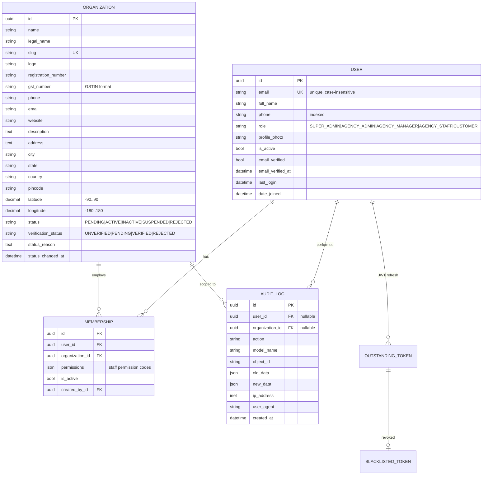
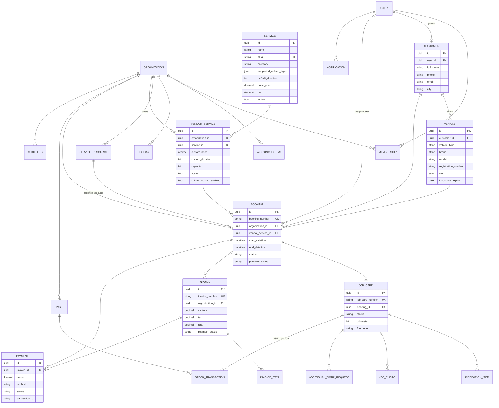

# Database

> Multi-Vendor Vehicle Service CRM — **built by Sahil Thakur**

PostgreSQL 16. All primary keys are UUIDs. All datetimes are timezone-aware (`USE_TZ=True`,
default zone `Asia/Kolkata`, stored in UTC).

## 1. Phase 1 — implemented tables



### Constraints & indexes

| Table | Constraint / index | Purpose |
|---|---|---|
| `accounts_user` | `UNIQUE(lower(email))` | Case-insensitive unique login |
| | `CHECK role IN (...)` | No invalid roles even via raw SQL |
| | index `phone`, `role` | Search / filtering |
| `organizations_organization` | `UNIQUE(slug)` | Public identifier |
| | `CHECK status`, `CHECK verification_status`, `CHECK lat/long range` | Data integrity |
| | index `(status)`, `(city, status)` | Admin filters; future "bookable agencies in city" lookup |
| `organizations_membership` | `UNIQUE(user, organization)` | No duplicates |
| | `UNIQUE(user) WHERE is_active` | **Exactly one active tenant per agency user** |
| | index `(organization, is_active)` | Member listing |
| `audit_logs_auditlog` | index `(organization, -created_at)`, `(user, -created_at)`, `(action, -created_at)`, `(model_name, object_id)` | Tenant-scoped timelines and object history |
| | **trigger** `audit_logs_auditlog_immutable` | Rejects every `UPDATE` / `DELETE` (append-only) |

FKs to `Organization` use `PROTECT` — tenants are suspended/deactivated, never deleted.
Audit log FKs use `PROTECT` for the same reason (and the trigger would block `SET NULL` anyway).

## 2. Full platform ERD (target design for Phases 2–11)



Design notes for later phases:

* Every tenant-owned table inherits `TenantModel` (`organization_id` + `TenantManager`).
* Booking double-booking prevention: `select_for_update()` on the `VendorService`/resource rows inside
  `transaction.atomic()`, conflict + capacity checks repeated inside the lock, plus a PostgreSQL
  exclusion constraint (`btree_gist`, `tstzrange(start, end) &&`) on `assigned_resource` where applicable.
* Human-readable numbers (`BK-2026-000001`, `JOB-…`, `INV-…`) come from a per-prefix/year counter row
  locked with `select_for_update`, not from `MAX()+1`.
* Customers are platform-level users; an agency "sees" a customer only through that customer's bookings
  with the agency, so customer data stays tenant-scoped.

## 3. Migrations

```bash
docker compose exec backend python manage.py migrate
docker compose exec backend python manage.py makemigrations --check --dry-run   # CI guard
```

---
Built by Sahil Thakur.
