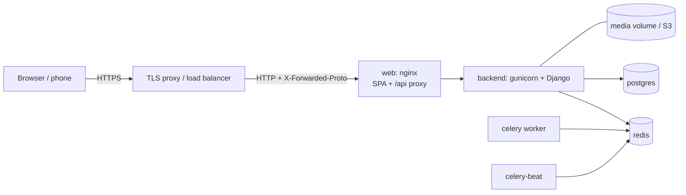

# Deployment

> Multi-Vendor Vehicle Service CRM — **built by Sahil Thakur**

## Production stack (`docker-compose.prod.yml`)



| Service | Image / command | Notes |
|---|---|---|
| `migrate` | `manage.py migrate` + `check --deploy` | one-shot; everything else waits for it |
| `backend` | `collectstatic` + `gunicorn config.wsgi` | health check `/api/v1/health/` |
| `celery` / `celery-beat` | worker + scheduler | reminders every 15 min, token cleanup nightly |
| `web` | `docker/frontend/Dockerfile.prod` (Node build → nginx) | SPA fallback, immutable asset caching, CSP, gzip |
| `postgres`, `redis` | official images with volumes | `btree_gist` ships with the postgres image |

```bash
cp .env.example .env.prod          # then fill in the production section and real secrets
docker compose -f docker-compose.prod.yml --env-file .env.prod up -d --build
docker compose -f docker-compose.prod.yml exec backend python manage.py createsuperuser
```

## Required environment (production)
```
DJANGO_SETTINGS_MODULE=config.settings.prod
DJANGO_SECRET_KEY=<50+ random chars>          JWT_SIGNING_KEY=<different random value>
DJANGO_ALLOWED_HOSTS=crm.example.com           TRUST_X_FORWARDED_FOR=True
POSTGRES_DB / POSTGRES_USER / POSTGRES_PASSWORD
CORS_ALLOWED_ORIGINS=https://crm.example.com   CSRF_TRUSTED_ORIGINS=https://crm.example.com
FRONTEND_URL=https://crm.example.com
EMAIL_BACKEND=django.core.mail.backends.smtp.EmailBackend (+ EMAIL_HOST…)
PAYMENT_PROVIDER=<your gateway adapter>        NOTIFY_SMS_PROVIDER / NOTIFY_WHATSAPP_PROVIDER=<adapters>
USE_S3_STORAGE=True (+ S3_*)                   API_DOCS_ENABLED=False
```
`prod.py` refuses to start without a strong `DJANGO_SECRET_KEY`, forces `DEBUG=False`, enables HSTS, secure cookies and
SSL redirect (the internal health probe is exempt), and adds WhiteNoise for admin/docs static files.

## Plugging in real providers
* **Payments** — implement `PaymentProviderInterface.charge/refund` (e.g. Razorpay/Stripe adapter) and set `PAYMENT_PROVIDER`.
  Webhook-driven confirmation is the next step for asynchronous gateways.
* **SMS / WhatsApp / e-mail** — implement `NotificationProvider.send` and set the `NOTIFY_*_PROVIDER` path.
No business code changes are needed for either.

## CI (`.github/workflows/ci.yml`)
Backend on PostgreSQL 16: migrations in sync, full pytest suite with coverage (incl. concurrency and DB-trigger tests),
OpenAPI validation, `check --deploy`, `pip-audit`. Frontend: typecheck, production build, `npm audit`.

## Go-live checklist
- [ ] Unique strong `DJANGO_SECRET_KEY` and `JWT_SIGNING_KEY`; secrets in a secret manager, not in git
- [ ] TLS in front of `web`; `X-Forwarded-Proto` forwarded
- [ ] Database backups + point-in-time recovery; Redis persistence
- [ ] `DJANGO_ADMIN_URL` changed from the default; API docs disabled or protected
- [ ] Real e-mail/SMS/payment providers configured and tested in a staging environment
- [ ] `seed_demo_data` **not** run (it refuses when `DEBUG=False` unless `--force`)
- [ ] Monitoring/alerts on the health endpoint, Celery queue length and 5xx rate
